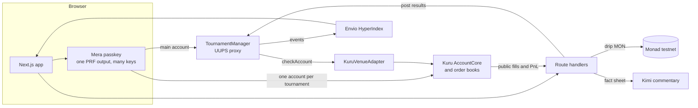

# Architecture

YoTrade lets any community host a trading tournament on Monad. Members join from a link with a passkey, trade real Kuru order books with standardized test capital, and are ranked by a score anyone can recompute. Prizes sit in a contract from the first minute and pay out without an operator.

## Components

| Part | Role |
|---|---|
| `packages/contracts` | `TournamentManager`: registry, prize escrow, results, dispute window, claims. Venue adapters prove a trading account belongs to the participant. |
| `apps/indexer` | Envio HyperIndex: tournaments, entries, results and trader stats as GraphQL. |
| `packages/core` | Plugin runtime: `definePlugin` and `createRuntime` give every integration the same client and chain. |
| `packages/plugins/*` | `plugin-mera` (passkey accounts), `plugin-kuru` (faucet, deposits, quotes, swaps, PnL), `plugin-tournament` (typed contract client), `plugin-alchemy` (RPC). |
| `apps/web` | Mobile-first app and the server routes: drip, leaderboard, finalize, commentary. |

## One passkey, many keys

A WebAuthn PRF output never leaves the browser. HKDF turns it into independent keys by label:

| Label | Use |
|---|---|
| `yotrade/v1/account` | Main account: hosts tournaments |
| `yotrade/v1/tournament/<chainId>/<id>` | Isolated trading account for one tournament |
| `yotrade/v1/vault` | AES-256-GCM key for private data at rest |

A fresh account per tournament means clean starting capital, no positions carried between tournaments, and a compromised session exposes one tournament at most. Nothing is persisted: a reload asks for the passkey again.

## Lifecycle

1. **Host**: gas drip → Kuru faucet → approve → `createTournament` escrows the pool.
2. **Join**: gas drip → faucet → deposit into Kuru → `join` records `capitalAtJoin` through the venue adapter. Measured live: 11 s from tap to registered.
3. **Trade**: market orders on Kuru with three guards: empty side, price impact against the top of the book, slippage after the quote.
4. **Score**: `(realized PnL inside the window + open inventory at the mark − its cost) / capitalAtJoin`. Inputs are Kuru's public fills and the contract's `capitalAtJoin`. Deposits and transfers are not fills, so they cannot move a score.
5. **Finalize**: anyone may trigger it after the end. The server recomputes the ranking and posts winners with a key that holds `SCORER_ROLE` only.
6. **Dispute window**: the admin can void wrong results before prizes unlock.
7. **Claim**: winners pull their share; unfilled ranks and rounding dust return to the organizer.

## Trust model

| Actor | Can | Cannot |
|---|---|---|
| Organizer | Create, cancel before start, reclaim if never scored | Touch an escrowed pool once trading started |
| Scorer | Post results after the end | Move funds, post before the end, exceed the prize ranks |
| Admin | Approve venues, void results inside the window, pause, upgrade | Pay anyone outside the posted split |
| Anyone | Recompute every score from public data, trigger finalization | Choose winners |

Details, invariants and known limits: [`packages/contracts/SECURITY.md`](../packages/contracts/SECURITY.md).

## Why Monad

A leaderboard that follows every fill needs blocks measured in hundreds of milliseconds and fees that make a 50 USDC order sensible. An onchain order book is the scoring oracle: fills are public, final in under a second, and the same for every participant.
