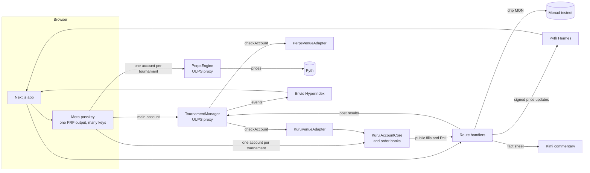

# Architecture

YoTrade lets any community host a trading tournament on Monad. Members join from a link with a passkey and trade on the venue the host picked: **Spot** on real Kuru order books with standardized test capital, or **Futures** on our onchain paper perpetuals priced by Pyth. Either way they are ranked by a score anyone can recompute. Prizes sit in a contract from the first minute and pay out without an operator.

## Components

| Part | Role |
|---|---|
| `packages/contracts` | `TournamentManager`: registry, prize escrow, results, dispute window, claims. Venue adapters prove a trading account belongs to the participant. `PerpsEngine`: cross-margin paper perpetuals, 20x cap, permissionless liquidation, settlement at the first Pyth price after the end. |
| `apps/indexer` | Envio HyperIndex: tournaments, entries, results and trader stats as GraphQL. |
| `packages/core` | Plugin runtime: `definePlugin` and `createRuntime` give every integration the same client and chain. |
| `packages/plugins/*` | `plugin-mera` (passkey accounts), `plugin-kuru` (faucet, deposits, quotes, swaps, PnL), `plugin-tournament` (typed contract client), `plugin-perps` (futures client, the engine's math in `bigint`, Hermes), `plugin-alchemy` (RPC). |
| `apps/web` | Mobile-first app and the server routes: drip, leaderboard, finalize, commentary, and the keyed Hermes proxy. |

## One passkey, many keys

A WebAuthn PRF output never leaves the browser. HKDF turns it into independent keys by label:

| Label | Use |
|---|---|
| `yotrade/v1/account` | Main account: hosts tournaments |
| `yotrade/v1/tournament/<chainId>/<id>` | Isolated trading account for one tournament |
| `yotrade/v1/vault` | AES-256-GCM key for private data at rest |

A fresh account per tournament means clean starting capital, no positions carried between tournaments, and a compromised session exposes one tournament at most. The identity is kept for the browser tab only (`sessionStorage`), so a reload comes back signed in while nothing reaches durable storage or another tab; closing the tab or signing out ends it.

## Lifecycle

1. **Host**: gas drip → Kuru faucet → approve → `createTournament` escrows the pool.
2. **Join**: gas drip → faucet → deposit into Kuru → `join` records `capitalAtJoin` through the venue adapter. Measured live: 11 s from tap to registered.
3. **Trade**: market orders on Kuru with three guards: empty side, price impact against the top of the book, slippage after the quote.
4. **Score**: `(realized PnL inside the window + open inventory at the mark − its cost) / capitalAtJoin`. Inputs are Kuru's public fills and the contract's `capitalAtJoin`. Deposits and transfers are not fills, so they cannot move a score.
5. **Finalize**: anyone may trigger it after the end. The server recomputes the ranking and posts winners with a key that holds `SCORER_ROLE` only.
6. **Dispute window**: the admin can void wrong results before prizes unlock.
7. **Claim**: winners pull their share; unfilled ranks and rounding dust return to the organizer.

A **private** tournament is hidden from the lists and needs an invite: the host's passkey derives an invite key per tournament (one more Mera namespace), its address goes onchain with `setInvite`, and the code travels in the link fragment. `join` presents the code's signature over a digest bound to chain, contract, tournament and participant. A leaked link is revoked by rotating to the next epoch; any device with the passkey finds the current one.

A **Futures** tournament differs in three steps. Joining is gas drip → `join`: the capital is a virtual 10,000 USD, the same for everyone. Trading sends a signed Pyth update with every order, so the fill price is the oracle's and not the trader's. The score is equity over the start; finalize first closes every open position at the first Pyth price at or after the end (`settle`), then posts the winners, so the ranking can be recomputed from the chain alone. Measured live: join 6 s, fill 3 to 5 s, finalize with settlement 6 s.

## Media and sharing

- **Logos** live in the tournament's onchain metadata as an https link. Hosts paste one or upload a file: the browser crops and shrinks it, the upload is signed by the host's account, sniffed by magic bytes, rate limited, and stored on Vercel Blob behind a two-method store interface. Viewers never fetch a logo from its origin: `/api/logo` resolves the host, refuses private addresses on every redirect hop, accepts images under 1 MB only, and caches. `LOGO_BLOCKLIST` hides a logo that must go.
- **Links unfurl** into a generated card (`/t/[id]/opengraph-image`) with the name, prize, market, dates and trader count, revalidated every minute. Public tournaments have a share button; private ones share through the host's invite card because their link carries the code.
- **Profiles** (name, avatar) are written by each tournament account to `ProfileRegistry` and read in one multicall per screen.

## Trust model

| Actor | Can | Cannot |
|---|---|---|
| Organizer | Create, cancel before start, reclaim if never scored | Touch an escrowed pool once trading started |
| Scorer | Post results after the end | Move funds, post before the end, exceed the prize ranks |
| Admin | Approve venues, void results inside the window, pause, upgrade | Pay anyone outside the posted split |
| Anyone | Recompute every score from public data, trigger finalization | Choose winners |

Details, invariants and known limits: [`packages/contracts/SECURITY.md`](../packages/contracts/SECURITY.md).

## Why Monad

A leaderboard that follows every fill needs blocks measured in hundreds of milliseconds and fees that make a 50 USDC order sensible. An onchain order book is the scoring oracle: fills are public, final in under a second, and the same for every participant.
